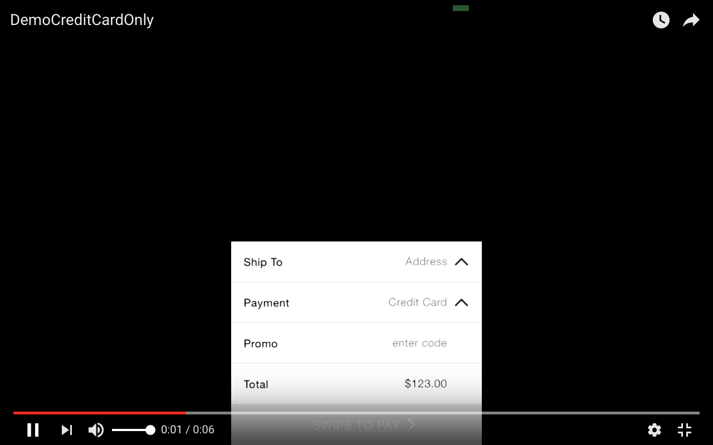
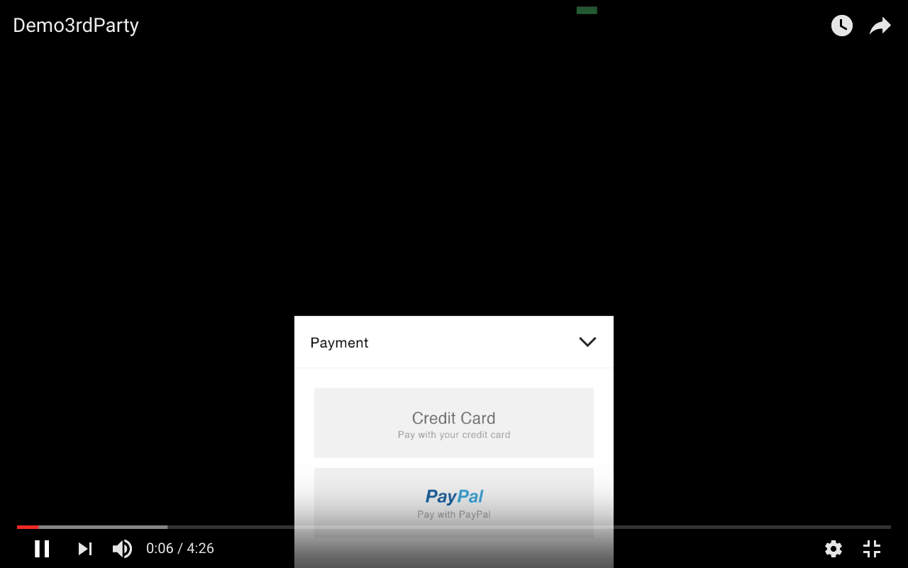

## Add this custom control to your Project

1. Download the custom control
2. Add `W2PaymentView` directory to your Project

## Implement

1 . Init environment in AppDelegate.h

```obj-c
#import "W2PaymentView.h"

- (BOOL)application:(UIApplication *)application didFinishLaunchingWithOptions:(NSDictionary *)launchOptions {
    [W2PaymentView initW2PaymentEnvironment];
    return YES;
}

```


2 . Create a UIViewController that comforms to `W2PaymentViewDelegate`

```obj-c
#import "W2PaymentView.h"

@interface ViewController ()<W2PaymentViewDelegate>

@end
```

3 . Create a `W2PaymentView` object

```obj-c
@interface ViewController ()<W2PaymentViewDelegate>

@property(nonatomic, strong)W2PaymentView *paymentView;

@end
```

4 . Init custom control

```obj-c

- (void)viewDidLoad {
    [super viewDidLoad];
    self.paymentView = [[W2PaymentView alloc]init];
    self.paymentView.frame = [UIScreen mainScreen].bounds;
    self.paymentView.delegate = self;
    [self.view addSubview:self.paymentView];
    [self.paymentView reloadData];
}

```

5 . Make an array off `W2PaymentCellFormatter` object

```obj-c

@interface ViewController ()<W2PaymentViewDelegate>

@property(nonatomic, strong)W2PaymentView *paymentView;
@property(nonatomic, strong)NSArray *arrCellSetup;

@end

-(void)cellSetUp
{
    W2PaymentCellFormatter *cell1 = [[W2PaymentCellFormatter alloc]init];
    cell1.cellTitle = @"Address";
    cell1.cellPlaceHolder = @"Address";
    cell1.cellType = W2PaymentCellAddress;
    cell1.subViewType = SubviewAddress;

    W2PaymentCellFormatter *cell5 = [[W2PaymentCellFormatter alloc]init];
    cell5.cellTitle = @"Payment";
    cell5.cellPlaceHolder = @"Payment";
    cell5.cellType = W2PaymentCellPayment;
    cell5.subViewType = SubviewPayment;

    W2PaymentCellFormatter *cell2 = [[W2PaymentCellFormatter alloc]init];
    cell2.cellType = W2PaymentCellEnterText;
    cell2.cellTitle = @"Promo";
    cell2.cellPlaceHolder = @"enter code";

    W2PaymentCellFormatter *cell3 = [[W2PaymentCellFormatter alloc]init];
    cell3.cellType = W2PaymentCellDefault;
    cell3.cellTitle = @"Total";
    cell3.cellPlaceHolder = @"$0.00";

    W2PaymentCellFormatter *cell4 = [[W2PaymentCellFormatter alloc]init];
    cell4.cellType = W2PaymentCellSwipe;

    self.arrCellSetup = @[cell1,cell5, cell2, cell3, cell4];
}

```

After that , back to `viewDidLoad` and add `[self cellSetUp]` to first line

```obj-c

- (void)viewDidLoad {
    [self cellSetUp];
    [super viewDidLoad];
    self.paymentView = [[W2PaymentView alloc]init];
    self.paymentView.frame = [UIScreen mainScreen].bounds;
    self.paymentView.delegate = self;
    [self.view addSubview:self.paymentView];
    [self.paymentView reloadData];
}

```

6 . Implement the `W2PaymentViewDelegate` delegate methods

```obj-c
-(NSUInteger)numberOfCellInPayment
{
    return self.arrCellSetup.count;
}

-(PaymentCell*)paymentView:(W2PaymentView *)payment cellForContentAtIndex:(NSInteger)index
{
    PaymentCell *cell = [payment cellWithFormatterObject:[self.arrCellSetup objectAtIndex:index]];
    return cell;
}

-(NSString*)paymentView:(W2PaymentView *)payment contentForCellAtIndex:(NSInteger)index
{
    if(index == 3)
        return @"$123.00";
    return @"";
}

```

*Note: Take a look at array of `W2PaymentCellFormatter` above, if cell type is `W2PaymentCellAddress`, `W2PaymentCellPayment` or `W2PaymentCellSwipe`, methods `contentForCellAtIndex:` can't set content for it*


## Fill data

To fill data shipping address and credit card , you must use an array of `AddressObject` and another array of `CreditCardObject`

```obj-c

@interface AddressObject : NSObject

@property(nonatomic, strong)NSString *fullName;
@property(nonatomic, strong)NSString *streetAddress;
@property(nonatomic, strong)NSString *city;
@property(nonatomic, strong)NSString *state;
@property(nonatomic, strong)NSString *zip;
@property(nonatomic, strong)NSString *phone;
@property(nonatomic, strong)NSString *addressId;

@end
```

```obj-c

@interface CreditCardObject : NSObject

@property(nonatomic, strong)NSString *cvc;
@property(nonatomic, strong)NSString *cardNumber;
@property(nonatomic, strong)NSString *last4;
@property(nonatomic, strong)NSString *expire;
@property(nonatomic, strong)NSString *postalCode;
@property(nonatomic, strong)AddressObject *billingAddress;
@property(nonatomic)enum CardType cardType;

@end

```
When you have array of `CreditCardObject` and array of `AddressObject` , you can add it to `paymentView`'s data

```obj-c

    [self.paymentView setCreditCardArray:self.arrCard andSelectedIndex:selectedCardIndex];

```

```obj-c

[self.paymentView setAddressArray:self.arrAddress andSelectedIndex:selectedAddressIndex];

```
## Other delegate methods (optional)

```obj-c

-(void)getDataFromServer
{
    //This methods will be called when init W2PaymentView
}

-(void)postPayment
{
    //This methods will be called when you "Swipe to pay" at W2PaymentCellSwipe
}

-(void)addCreditCard:(CreditCardObject *)obj
{
    //This action will be call when you tap "Done" in view add credit card . If credit card is valid , use [paymentView reloadData] or [paymentView setCreditCardArray:andSelectedIndex] to close view add credit card
}

-(void)addAddress:(AddressObject *)obj
{
    //This action will be call when you tap "Done" in view add address . If address is valid , use [paymentView reloadData] or [paymentView setAddressArray:andSelectedIndex] to close view add address
}

-(void)paymentView:(W2PaymentView *)payment didEnterText:(NSString *)text forCellAtIndex:(NSInteger)index
{
    //If have cells with type W2PaymentCellEnterText , this action will be call when text entered
}

```
## Layout configuration

To change W2PaymentView layout , find "W2PaymentViewConfig.plist" to change font , color , ...

If you want to change title of Done , add card , add address button,.... set it to these propertys of W2PaymentView

```obj-c

@property(nonatomic, strong)NSString *swipeCellTitle;
@property(nonatomic, strong)NSString *doneButtonTitle;
@property(nonatomic, strong)NSString *addCardButtonTitle;
@property(nonatomic, strong)NSString *addAddressButtonTitle;
@property(nonatomic, strong)NSString *changeBillingAddressButtonTitle;
@property(nonatomic, strong)NSString *cancelChangeBillingButtonTitle;
@property(nonatomic, strong)NSString *namePlaceholder;
@property(nonatomic, strong)NSString *streetPlaceholder;
@property(nonatomic, strong)NSString *statePlaceholder;
@property(nonatomic, strong)NSString *zipCodePlaceholder;
@property(nonatomic, strong)NSString *cityPlaceholder;
@property(nonatomic, strong)NSString *phonePlaceholder;
@property(nonatomic, strong)NSString *cardNumberPlaceholder;
@property(nonatomic, strong)NSString *cvcPlaceholder;
@property(nonatomic, strong)NSString *expirePlaceholder;

```

##Add third party payment

After init payment view , add this line
```obj-c

self.paymentView.useThirdPartyPayment = YES;

```

Implement delegate method 

```obj-c

-(void)thirdPartyPaymentDidChoose
{
//Show third party payment view
}

```

After you get the payment token , use `thirdPartyPaymentDidLoginSuccess` to complete

```obj-c

[self.paymentView thirdPartyPaymentDidLoginSuccess];

```

##Demo video

W2PaymentView without third party 

[](https://youtu.be/pqQHhY2Dhac)


W2PaymentView with third party (I use PayPal for demo)

[](https://youtu.be/p-TGVeLDGbI)

